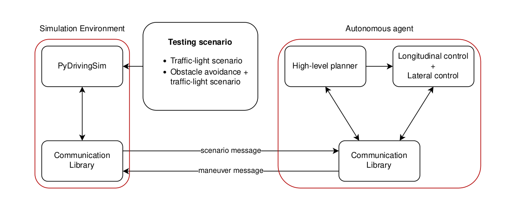

# Autonomous driving simulator

The project consists in a semplified version of an autonomous driving system, in particular are developed the longitudinal control for a traffic-light intersection and a lateral control for obstacle avoidance.
The path plannig is performed using the high-level planner RRT (rapidly-exploring random tree)
The longitudinal control is performed using the motion primitive technique
The lateral control is performed using the preview point lateral control (is also defined the clothoid based lateral control)



## Compile agent communication library

   1) enter inside the folder agent_communication_lib
```
cd agent_communication_lib
```
   2) compile the project with cmake (need ruby)
```
cmake -Bbuild
cmake --build build -t install
```
   3) copy file in bin/lib/libagent_lib.so into ../PyDrivingSim/agent
   4) copy file in bin/lib_static/libagent_lib.a into ../basic_agent_st/lib

## Compile Clothoids library

   1) enter inside the folder Clothoids
```
cd basic_agent/Clothoids
```
   2) compile the project with cmake
```
cmake -Bbuild
cmake --build build -t install
```

## Compile basic_agent

   1) enter inside the folder basic_agent
```
cd basic_agent
```
   2) compile the project with cmake
```   
cmake -Bbuild
cmake --build build
```
## Run the project

Open two different terminals

**Run basic_agent in the first terminal**

   1) enter inside the folder basic_agent
```
cd basic_agent
```
   2) run basic_agent
```
./bin/basic_agent
```

**Run pydriving simulator in the second terminal**

   1) enter inside the folder PyDrivingSim
```
cd PyDrivingSim
```
   2) run  simulator.py
   * to simulate the traffic-light environment
```
python3 simulator.py 0
```
   * to simulate the traffic-light environment + obstacle avoidance
```
python3 simulator.py 1
```